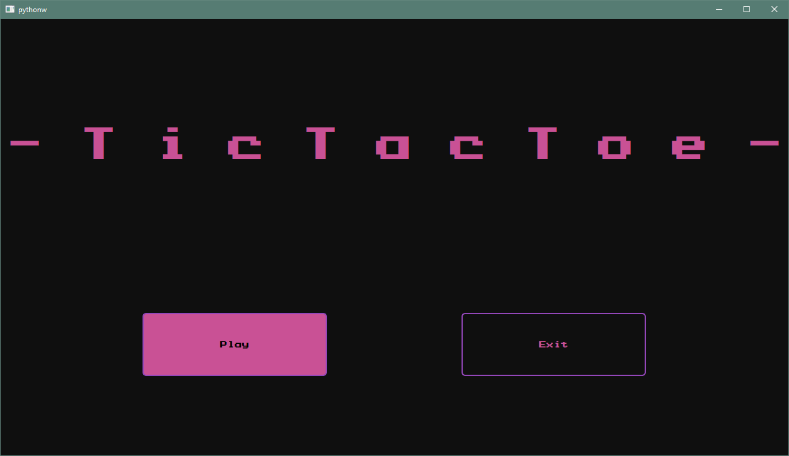
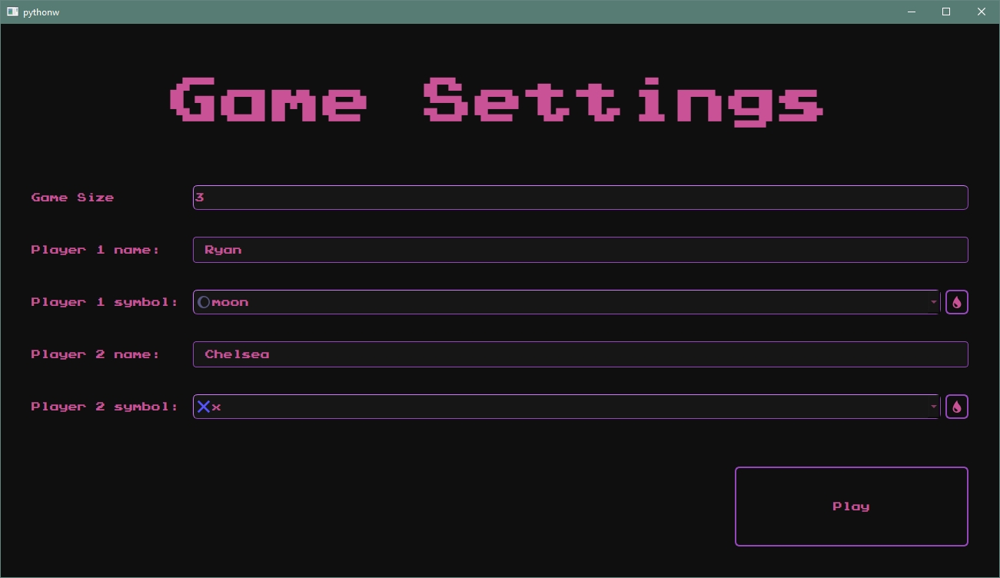
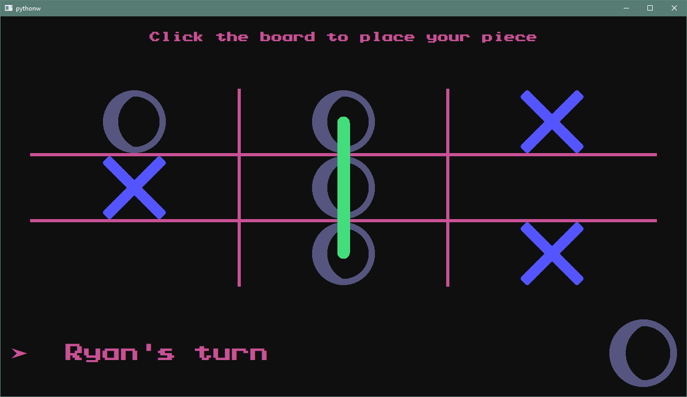
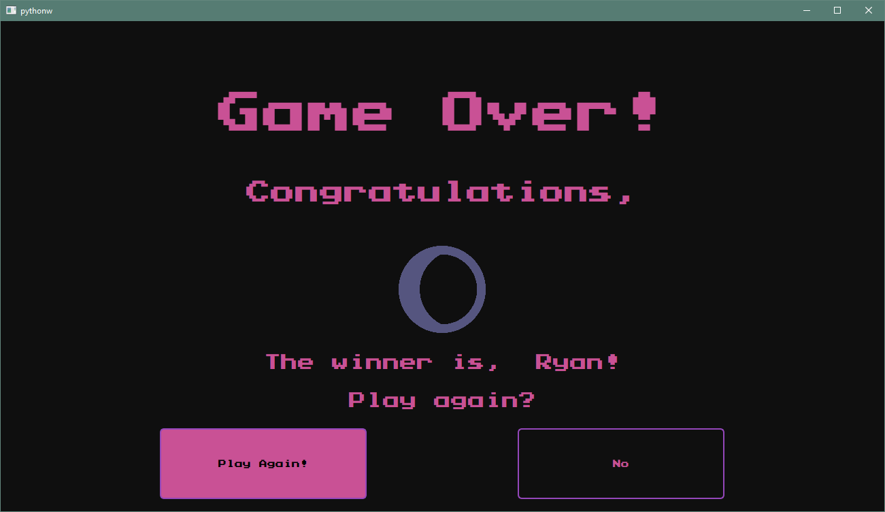

# Tic Tac Toe

This is a small project that demonstrates an intermediate level of seperation between business logic and front
end UI. It uses the PySide6 package for the front end and some simple pure python objects as the back end.

This was made as a teaching example, where the student observed the structure being built and also made changes
and stylistic descisions about the front end. The student would do things like alter the layouts and QSS.

## Game Features

- Players can chose their name
- Players can chose a unique symbol from a variety of choices (configurable by the data folder or svgs)
- The "game size" can be changed to play something liek tixtactoe but with greater or lesser grid size
- The GUI is designed to react well to QSS changes and uses QProperties to communicate with the style sheets
- There are some fancy animations and polishing that make the game look pretty dang sweet

  
  
  
  

